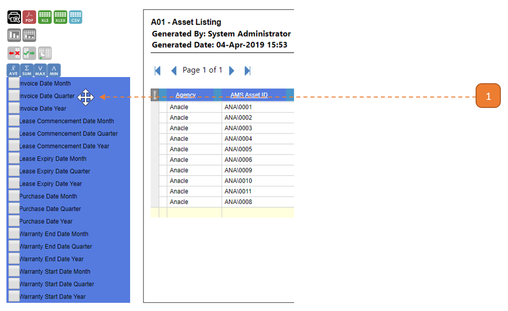
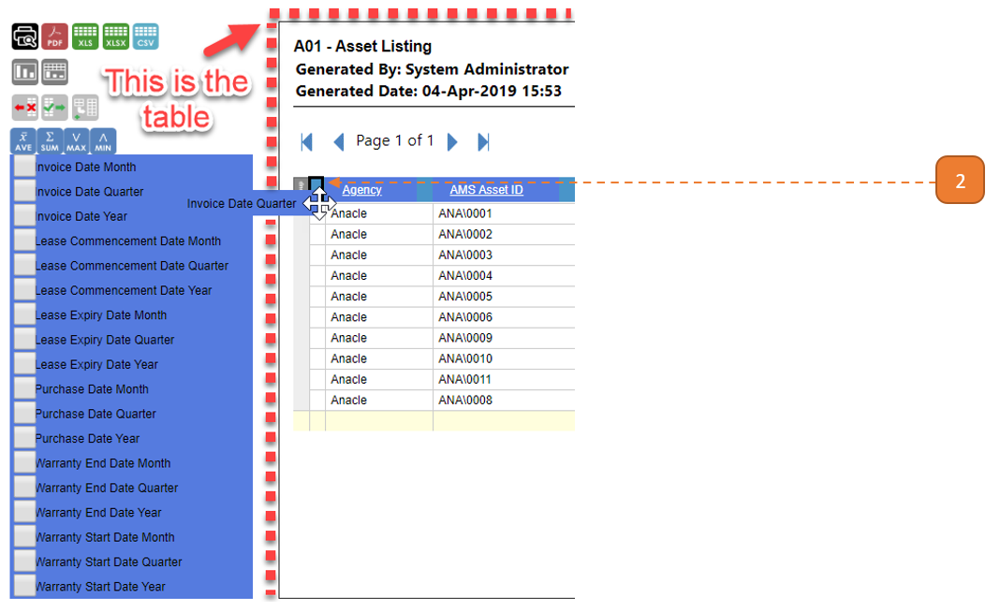

# Adding/Removing Columns

## How do I add columns?

1. Hover around the **column header** until the **4 Arrow-Cursor** is observed. 

- Click and drag the column header. The column header should float with the cursor.

2. While holding on to the mouse click, **move into the table**. 
Hover over to the blank spaces between the 2 columns. 

When a **bolded outline** is seen, **release** the mouse click. 

The column will fill between these 2 columns.

## How do I remove columns?

To remove the column, click and drag the column header **out of the table**.