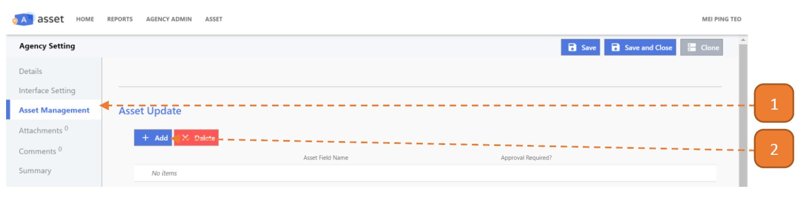
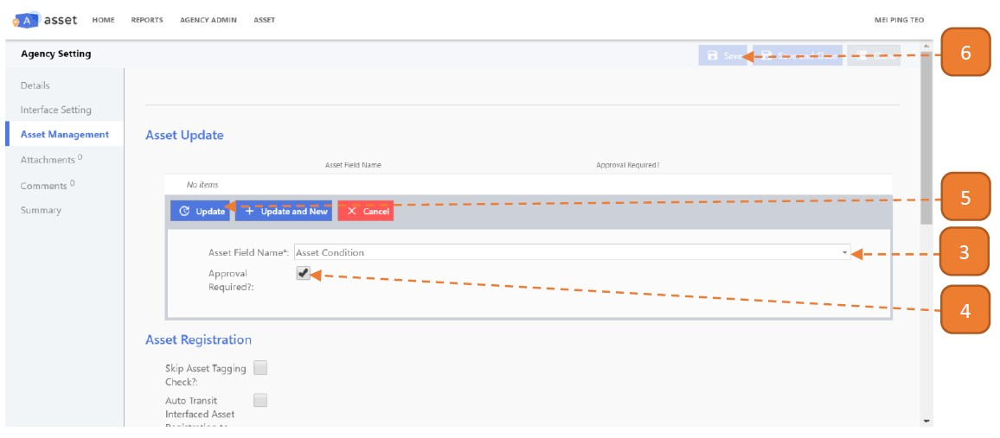

# Approval for Asset Update

## How do I define the field(s) Requiring Approval for Asset Update?

> Navigate to: **Agency Admin > System Administration > Agency Setting**

1. Select the **Asset Management** tab.

2. Select the **Add** button.

3. Select the **Asset Field Name**.

4. Check the option **"Approval Required?"**.

5. Select **Update**.

6. Select **Save**.

