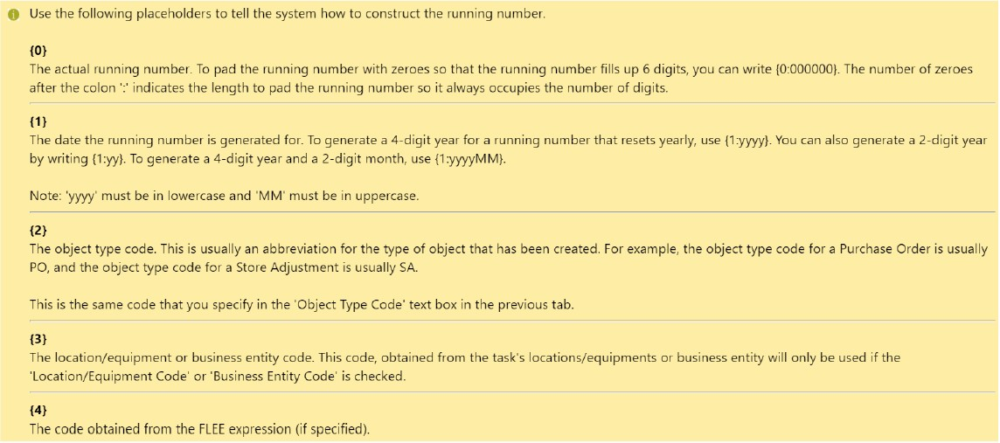

# Asset ID Format

## How do I define the Asset ID format?

> Navigate to: **Agency Admin > System Administration > Agency Setting**

1. Select the **Asset Management** tab.

2. Fill in the **AMS Asset ID** Format to generate customised Asset ID. In this example, the first asset registered in the system will display as **"ANA\000001"**.

Please refer to the table below for format reference.

