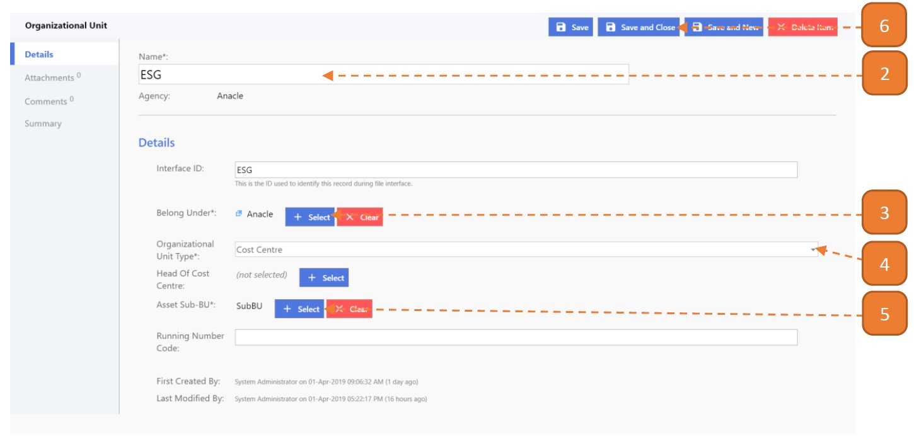

# Cost Centre

## How do I create a Cost Centre?

> Navigate to: **Agency Admin > General Administration > Organizational Unit**

1. Select **New**.

2. Enter **Name** and the **Interface ID** will be automatically populated.

3. Select the Agency where this Cost Centre should belong to.

4. Select the **Organizational Unit Type** as **"Cost Centre"**.

5. Select the **"Sub-BU"** where this Cost Centre should belong to.

6. Select **Save and Close**.

