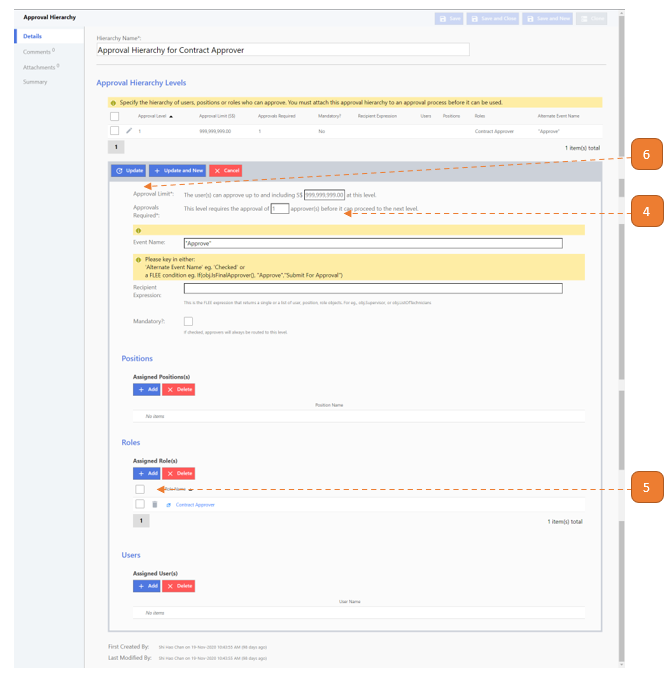

# Create New Approval Hierarchy

## How do I create a (New) Approval Hierarchy?

> Navigate to: **Agency Admin > Workflow Administration > Approval Hierarchy**

1. Select **New**.

2. Enter the **Hierarchy Name**.

3. Select **Add**.

4. Under **Approval Limit**, enter 999999999 (nine nine's).

5. Select the **Add** button and search for the applicable role. 
In this example, approval is for contract creation & update & termination & expiry, where the applicable approvers are the users with **"Contract Approver"** roles.

6. Select **Update**.

7. Select **Save and Close**.

