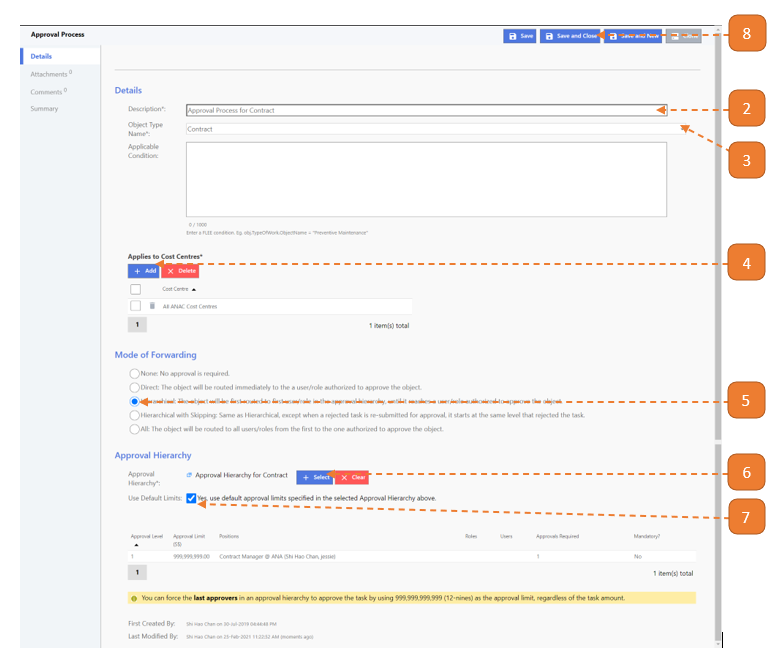

# Create New Approval Process

## How do I create a (New) Approval Process?

> Navigate to: **Agency Admin > Workflow Administration > Approval Process**

1. Select **New**.

2. Enter the **Description**.

3. Select the **Object Type Name**. 
It should correspond with the module name. 
In this example, we are configuring approval for the Contract page.

4. Select the **Add** button and search for all <Agency> Cost Centres.

5. If Approval is required, select **Hierarchical**.

6. Select the **Select** button. 
In this example, approval is for contract creation & update & termination & expiry, approval hierarchy for contract is selected for it to be routed to Contract Approver.

7. Select the **Use Default Limits** checkbox.

8. Select **Save and Close**.

