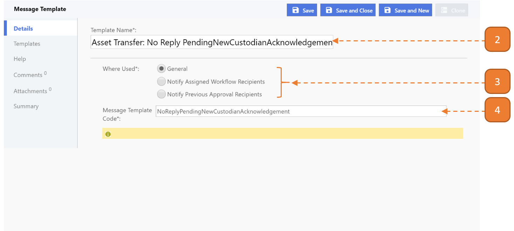
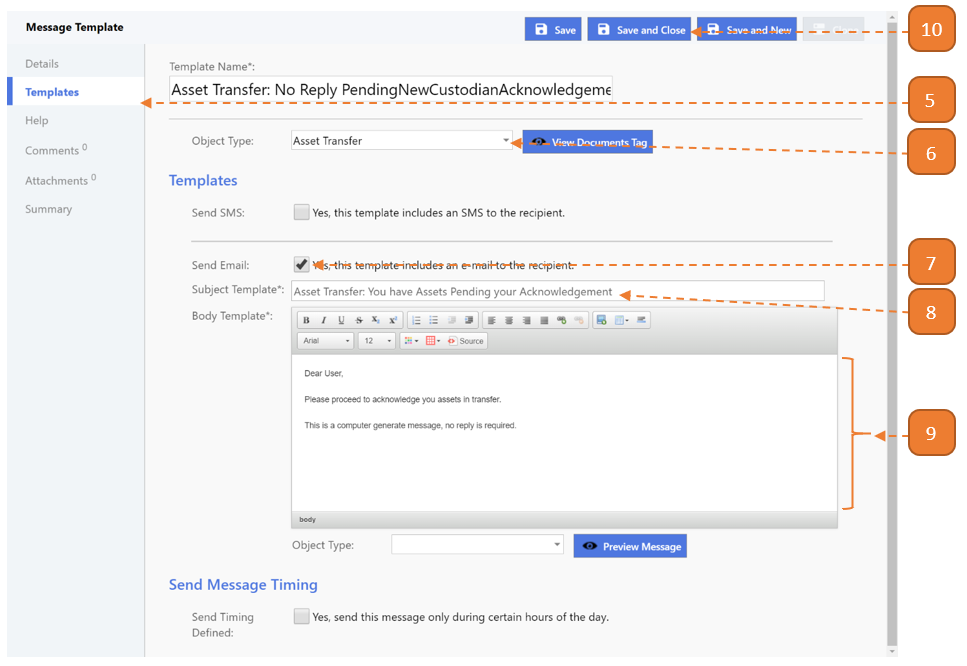

# Creating Message Template

## How do I create a Message Template?

> Navigate to: **Agency Admin > Communication > Message Template**

1. Select the **New** button.

2. Enter the **Template Name**.

3. Select **Where Used**.

- **General:** For Workflow Escalation (Refer to [Create Workflow Escalation](create-workflow-escalation) to link the associated templates with workflow escalation).

- **Notify Assigned Workflow Recipients:** To notify the next workflow state's recipients.

- **Notify Previous Approval Recipients:** To send an acknowledgement to the approver after he/she has approved.

4. Enter the **Message Template Code**. Do not use **<space>** in the code.

5. Select the **Templates** tab.

6. Select the **Object Type**.

- This refers to the module that the template is associated with.

7. Check the option **Send Email**.

8. Fill in the **Subject Template**.

- This will become the subject title of the email.

9. Fill in the **Body Template**.

- This will become the content of the email.

10. Select **Save and Close**.

