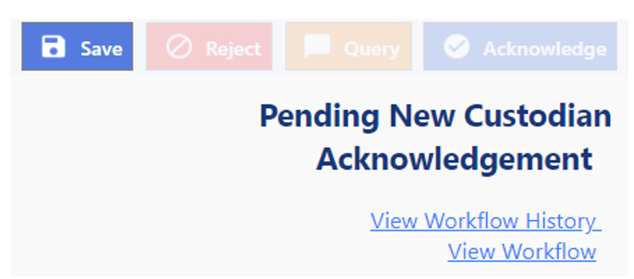
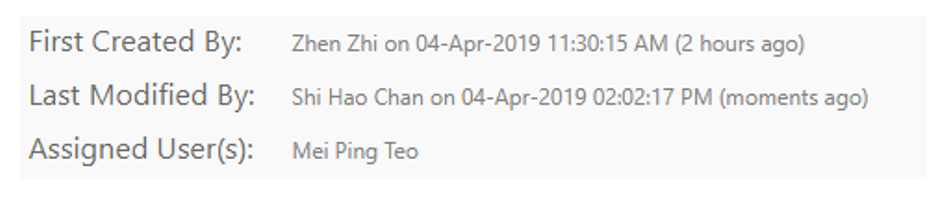
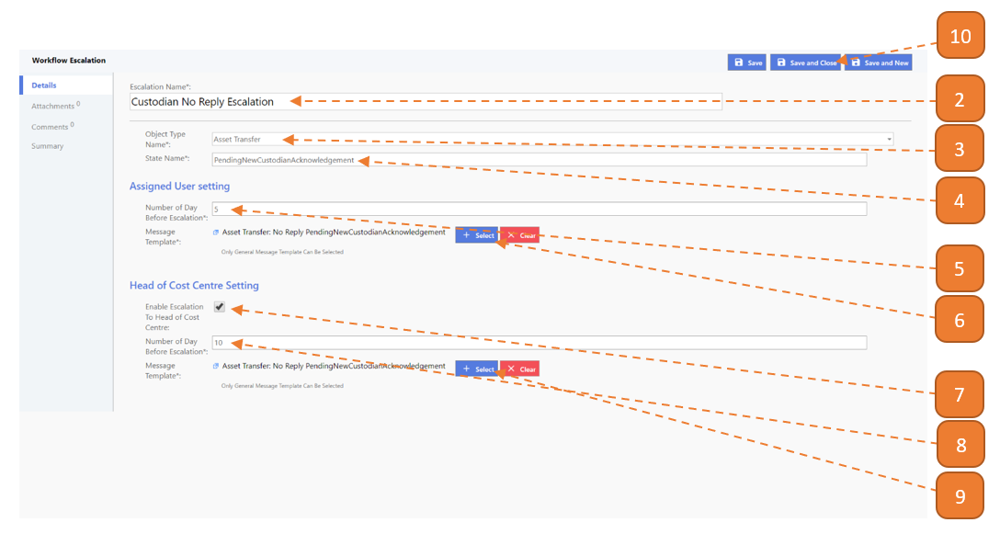

# Creating Workflow Escalation

## How do I create a Workflow Escalation?

> Navigate to: **Agency Admin > Workflow Administration > Workflow Escalation**

1. Select the **New** button.

2. Enter the **Escalation Name**.

3. Select the **Object Type Name** that is associated with the escalation.

4. Enter the **State Name**.

- All transactions have a workflow state which can be found at the **top right of the page**.

- In the example image below, the workflow state is "Pending New Custodian Acknowledgement", the state name is therefore "PendingNewCustodianAcknowledgement" (No spaces, capital letter on the first letter of every word).

5. Enter the **Number of Day Before Escalation** (For Assigned User).

This refers to the **no. of days the transaction is in this workflow state before an escalation is sent to the assigned user**.

- In the example image above, if the workflow state is stuck on "Pending New Custodian Acknowledgement" for X "Number of Day Before Escalation", the message will be sent to the recipient.

- The recipient is the assigned user of the transaction, this may be found at the bottom of each transaction (see image below).

6. Select the **Message Template** (For Assigned User).

7. Check the option **Enable Escalation To Head of Cost Centre**.

- **Note:** This is checked only if the head of cost centre needs to be notified.

8. Enter the **Number of Day Before Escalation** (For Head of Cost Centre).

9. Select the **Message Template** (For Head of Cost Centre). The message template may be different from No.6.

10. Select **Save and Close**.

