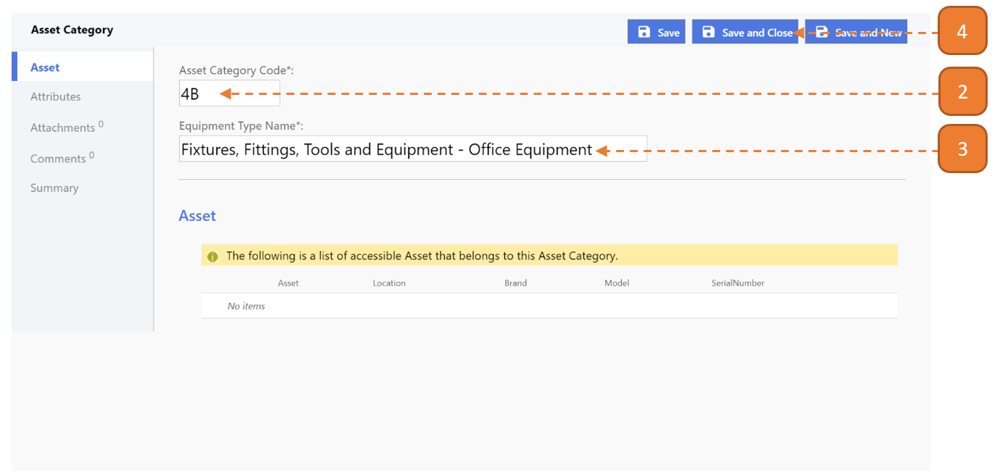

# Creating a New Asset category

## How do I create a New Asset Category?

> Navigate to: **Agency Admin > General Administration > Asset Category**

1. Select the **New** button.

2. Enter the **Asset Category Code**.

3. Enter the **Equipment Name Type**.

4. Select **Save and Close**.

