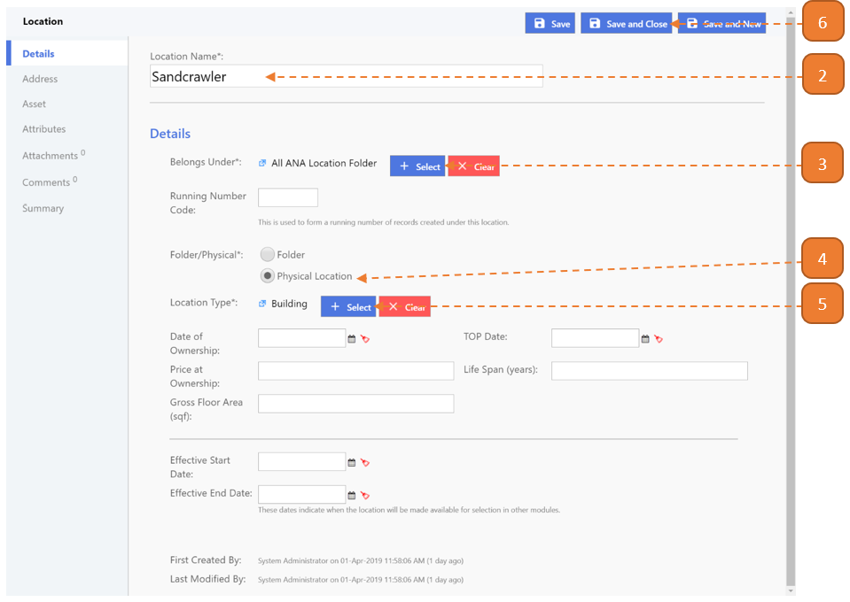

# Creating a New Location

## How do I create a New Location?

> Navigate to: **Agency Admin > General Administration > Location**

1. Select the **New** button.

2. Enter the **Location Name**.

3. Select where the location **Belongs Under**.

The recommended location hierarchy is in this order:

- Agency: Eg. All ANA Location Folder
- Site: Eg. Fusionopolis
- Building: Eg. Sandcrawler Building
- Floor: Level 8
- Unit: #08-02

4. Select if it's a **Folder/Physical Location**.

5. Select the **Location Type**.

6. Select **Save and Close**.

