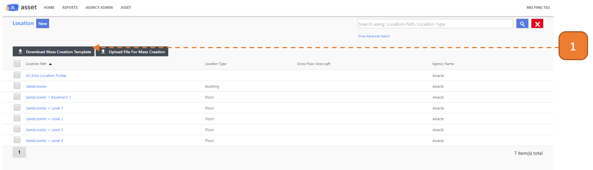
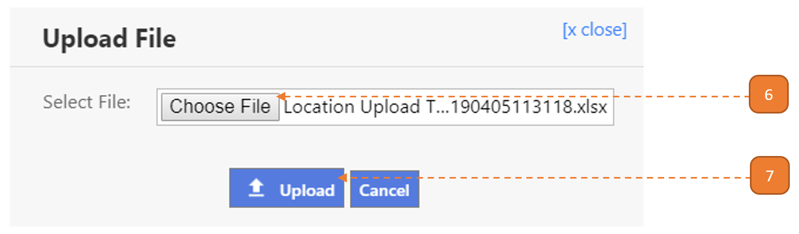

# Creating a New Location

## How do I create a New Location?

> Navigate to: **Agency Admin > General Administration > Location**

1. Select the **New** button.

2. Enter the **Location Name**.

3. Select where the location **Belongs Under**.

The recommended location hierarchy is in this order:

- Agency: Eg. All ANA Location Folder
- Site: Eg. Fusionopolis
- Building: Eg. Sandcrawler Building
- Floor: Level 8
- Unit: #08-02

4. Select if it's a **Folder/Physical Location**.

5. Select the **Location Type**.

6. Select **Save and Close**.

# Create New Location via Excel Upload

## How do I create a New Location via Excel Upload?

> Navigate to: **Agency Admin > General Administration > Location**

1. Select the **Download Mass Creation Template** button.

2. Open the downloaded excel file (Selection to opening the file may depend on browser).

3. In the Upload Sheet worksheet, enter the **Location Name**, **Belong Under**, **Folder/Physical** and **Location Type**.

You may refer to the **Master Data** worksheet below.

How to refer to the Master Data Example:

- For a new entry you wish to enter the **"Location Type"**.

- On referring to the Master Data you understand that you may enter only **“Building”**, **“Floor”**, **“Site”** or **“Unit"**.

4. Enter the mandatory fields denoted by the **orange column header**.

5. Save the Mass Creation Template Excel file. Return to the webpage and select **Upload File for Mass Creation** button.

6. Select the **Choose File** button.

7. Select the **Upload** button.

Once the upload is confirmed, the system will check the excel records for errors. When this validation is complete, a summary will be shown.

8. If **critical errors/warnings are found**, select the **Download Validated Excel** button.

- The first 2 columns on the validated worksheet will describe the critical errors/warnings that is present in the line item such as "**Belong Under text** cannot be found."

9. Otherwise, if **no critical errors/warnings are found**, select **Confirm to Proceed**.

10. Select the **Close** button.

11. The entries will be found on the search page.

