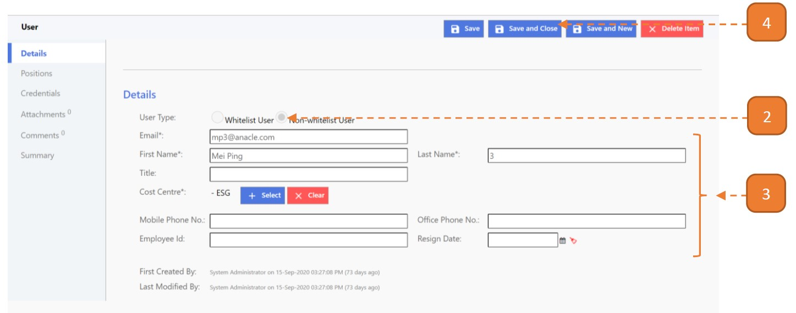
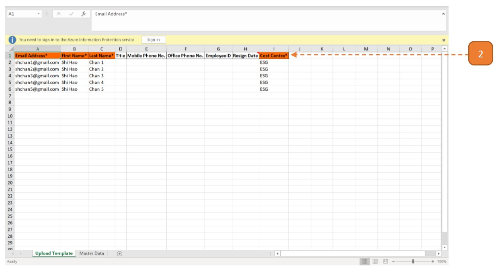
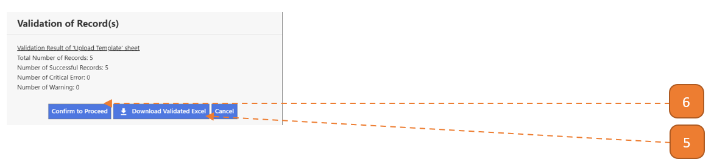
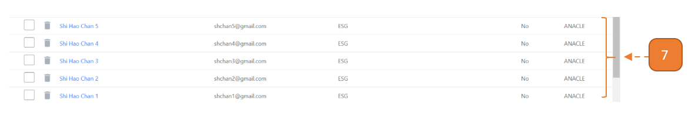

# Creating a Non-Whitelist User

## What is a "Non-Whitelist" User?

Non-whitelist users refer to users without an SOE email. Note that non-whitelist users can only function as an end user in the system.

Ensure that Non-whitelist users are [enabled](EnableNon-WhitelistUsers) before performing the following steps.

## How do I create a Non-Whitelist User?

> Navigate to: **Agency Admin > User Administration > User**

1. Select **New**

2. Select **“Non-whitelist User”** radio.

3. Enter the mandatory fields.

4. Select **Save and Close**.

# Creating a Non-Whitelist User using Excel Upload

## How do I create a Non-Whitelist User using Excel Upload?

> Similarly, navigate to: **Agency Admin > User Administration > User**

1. Select **Download Non-Whitelist Mass Upload Template**.

2. Open the Excel worksheet.

3. Enter relevant fields and save the workbook. For the **"Cost Centre"** column, refer to the **"Master Data"** worksheet for the available cost centres.

4. Select **“Upload Non-whitelist File For Mass Creation”**.

Browse and upload the file. 

Once the upload is confirmed, the system will check the Excel records for errors. 
When this validation is complete, a summary will be shown as follows.

5. If **no critical errors/warnings** are found, select **Confirm to Proceed**.

6. Otherwise, select **Download Validated Excel**. 

The first 2 columns on the validated worksheet will describe the critical errors/warnings that is present in the line item such as “[Cost Centre] cannot be found.”

7. All records will be successfully pushed into the search page.

