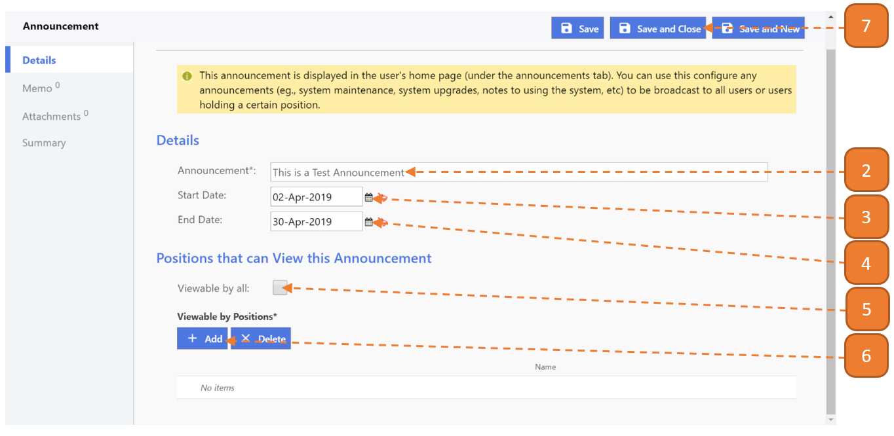

# Creating an Announcement

## How do I create an Announcement?

> Navigate to: **Agency Admin > Communication > Announcement**

1. Select the **New** button.

2. Enter the **Announcement** that you wish to broadcast.

3. Select the **Start Date**.

4. Select the **End Date**.

5. Check **Viewable by all** if you wish for everyone to view the announcement (ignore next step if this item is checked).

6. If you wish for the announcement to be viewable by certain position (such as stocktakers), select **Add**.

- You may select more than one position.

7. Select **Save and Close**.

