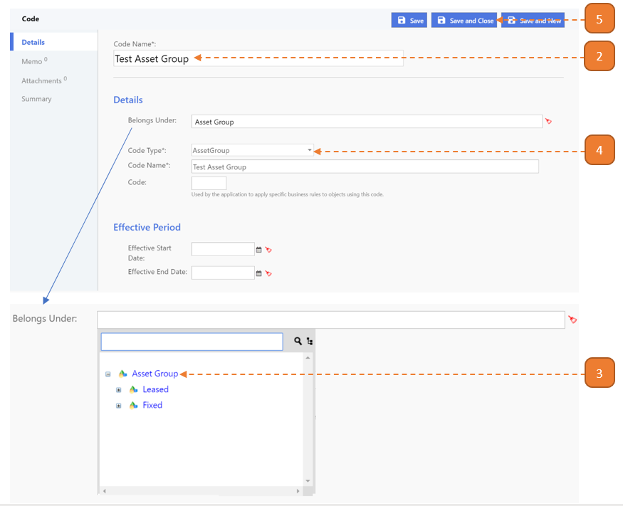

# Define New Asset Group

## How do I define a New Asset Group?

> Navigate to: **Agency Admin > General Administration > Code**

1. Select the **New** button.

2. Enter the **Code Name**.

3. Select **"Asset Group" found in Belongs Under**.

4. Select **"Asset Group"** as **Code Type**.

5. Select **Save and Close**.

