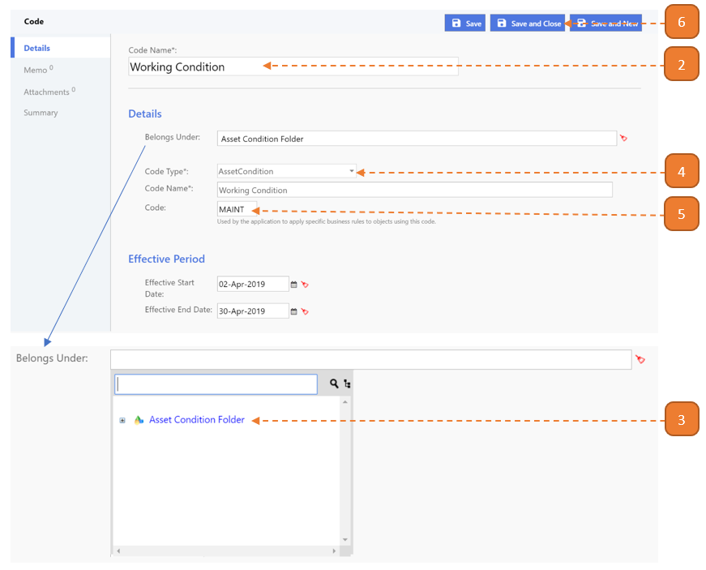

# Define New Maintenance Condition

## How do I define a New Maintenance Condition?

> Navigate to: **Agency Admin > General Administration > Code**

1. Select the **New** button.

2. Enter the **Code Name**.

3. Select **"Asset Condition Folder"** found in **Belongs Under**.

4. Select **"AssetCondition"** as **Code Type**.

5. Enter **"MAINT"** for the **Code** (Only applicable for [New Maintenance Condition](#define-new-maintenance-condition)).

6. Select **Save and Close**.

