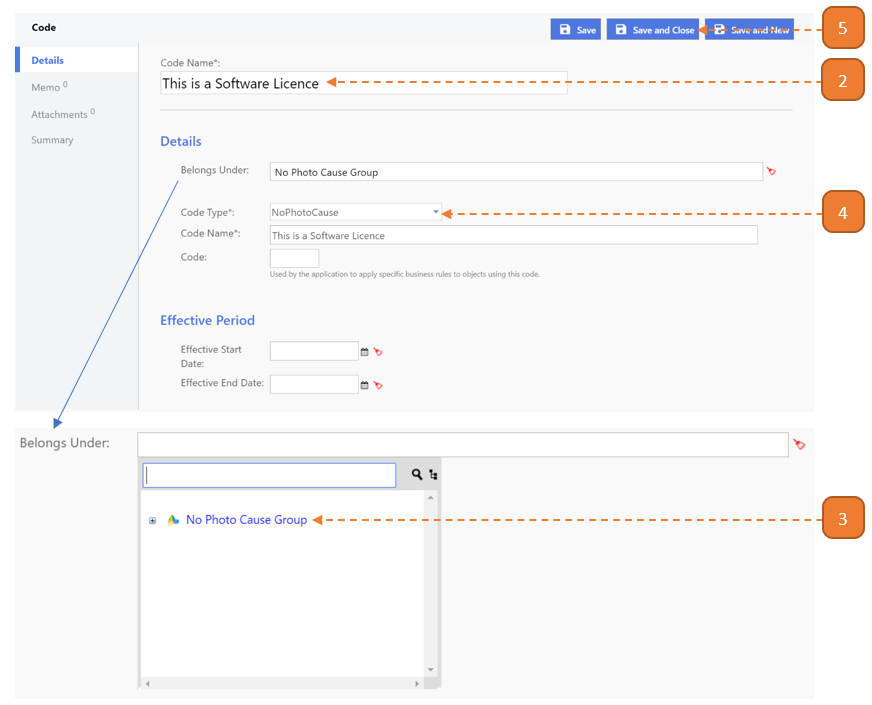

# Define New Reason for No Photo (Asset Tagging)

## How do I define a New Reason for No Photo being uploaded during Asset Tagging?

> Navigate to: **Agency Admin > General Administration > Code**

1. Select the **New** button.

2. Enter the **Code Name**.

3. Select **"No Photo Cause Group"** found in **Belongs Under**.

4. Select **"NoPhotoCause"** as **Code Type**.

5. Select **Save and Close**.

