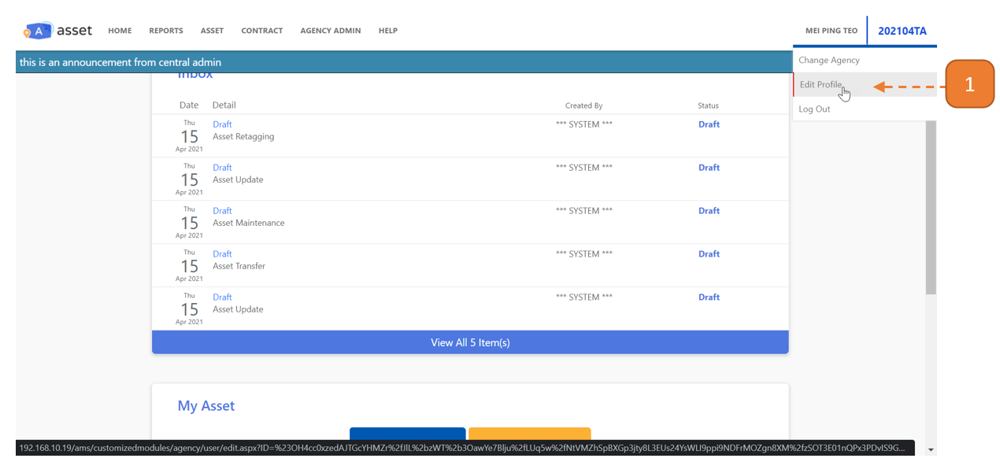
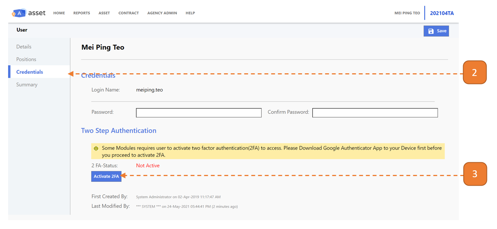
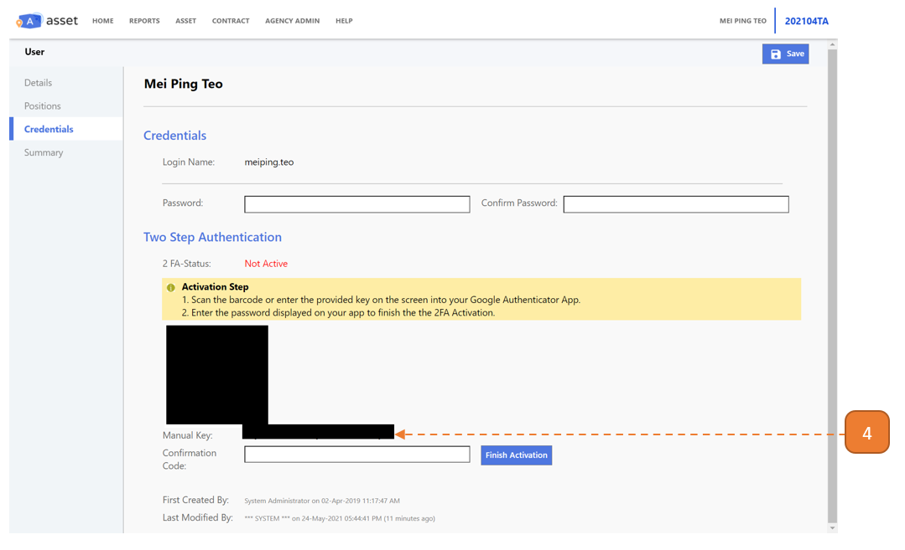
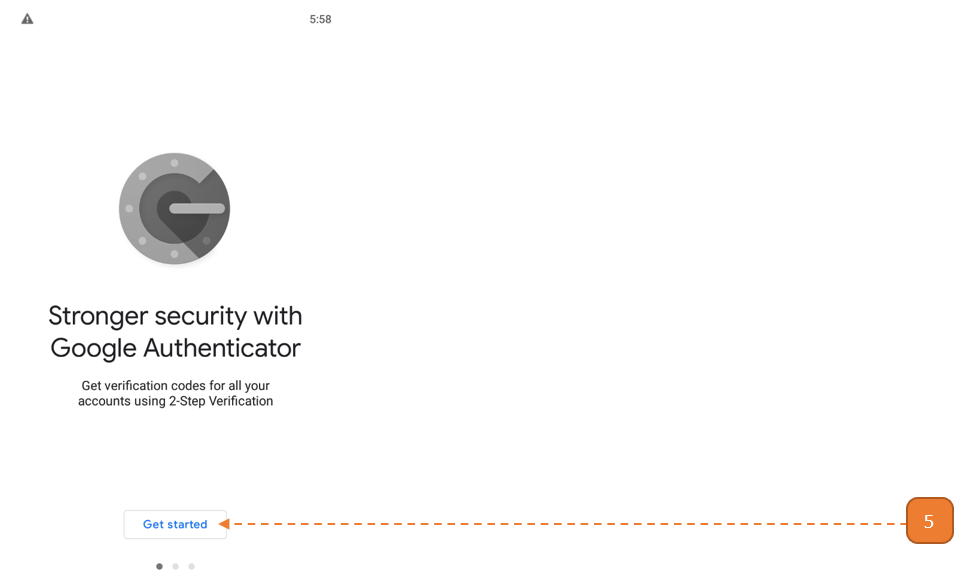
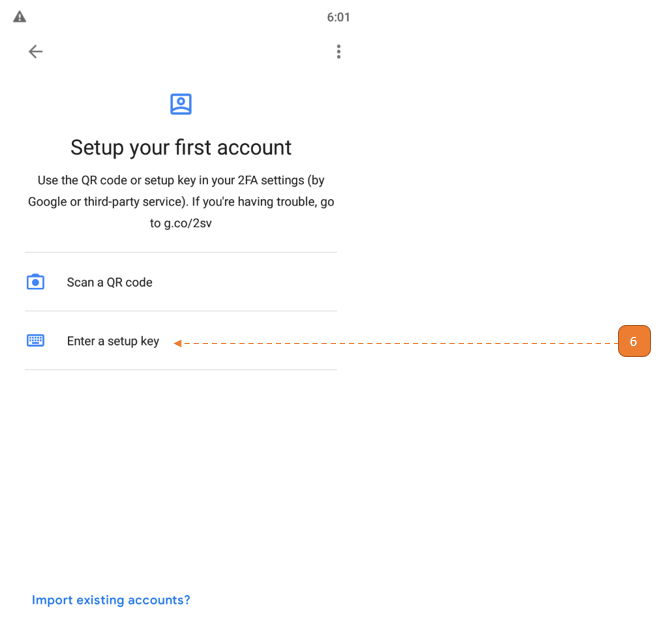
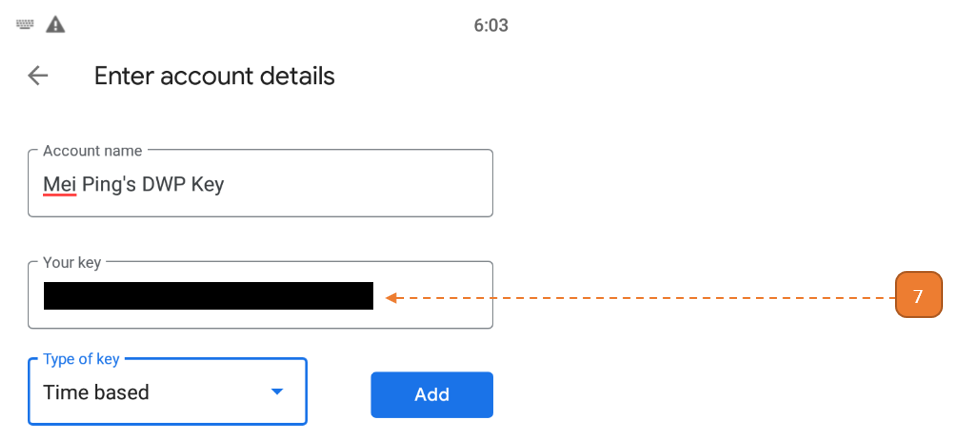
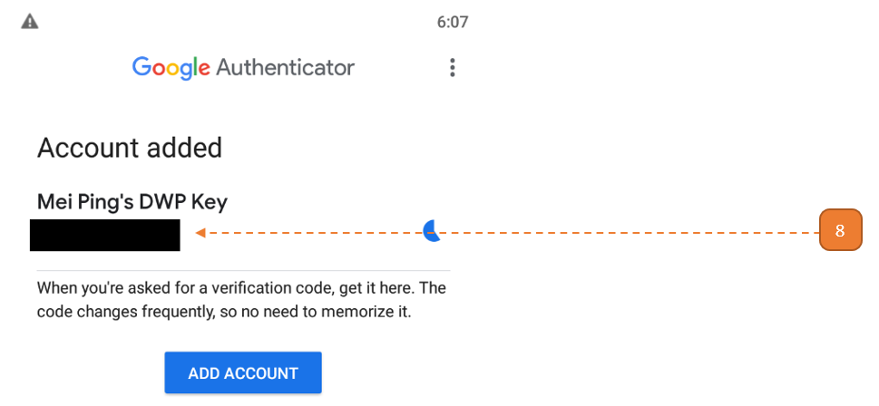
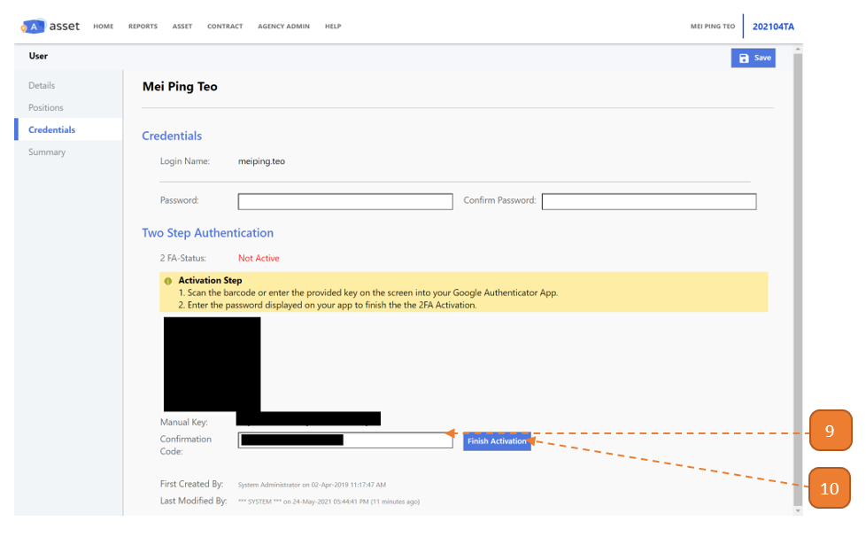
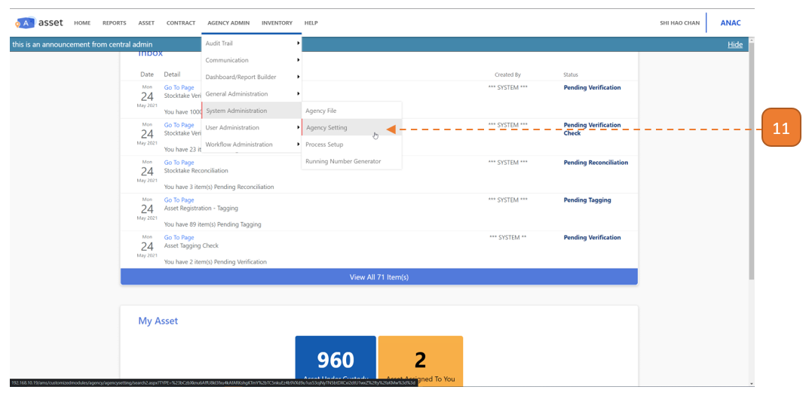
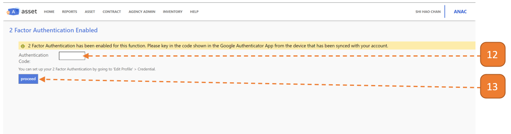

# Enable 2FA to Access Admin Functions

## How do I Enable 2FA to access Admin Functions?

> **Note:** In Production DWP, AMS will require users to enter a 2FA to access Agency Admin functions.

1. Hover over your **username** on the **top right of the screen**, you will see a dropdown. 
Select **Edit Profile**.

2. Select the **Credentials** tab.

3. Select **Activate 2FA**.

4. A **manual key** will show.

5. Go to your mobile phone and install "Google Authenticator". 
Open the app to Get started.

6. Select **Enter a setup key**.

7. Enter the required fields below. Paste the manual key from **Step 4**.

8. Copy the pairing key given.

9. Paste the pairing key in **Step 8** into the **Confirmation Code**.

10. Select **Finish Activation**.

11. Navigate to any Admin Function eg. AGENCY ADMIN > System Administration > Agency Setting.

12. Paste the pairing key in **Step 8** into **Authentication Code**.

13. Select **Proceed**.

