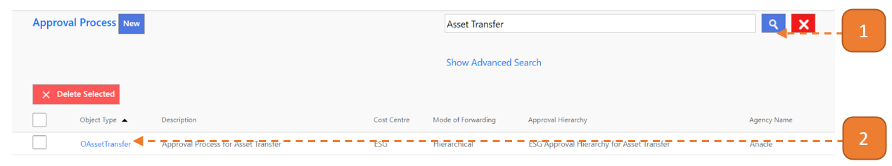
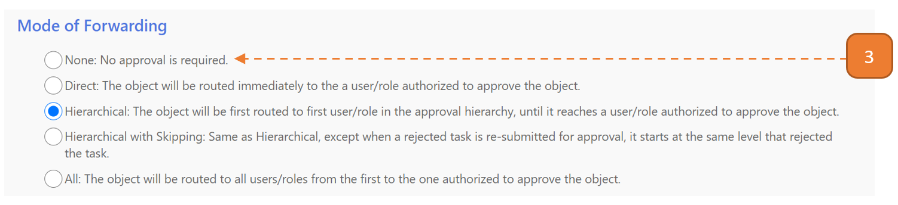
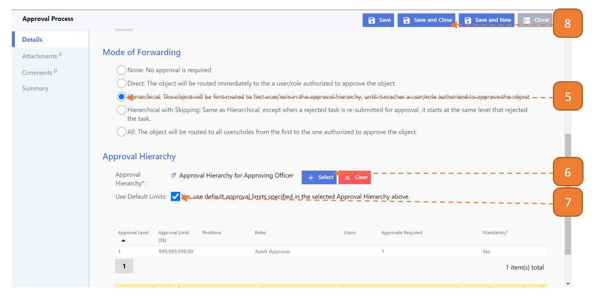

# Enable/Disable Approval Required

## How do I Enable/Disable Approval Required?

> Navigate to: **AGENCY ADMIN > Workflow Administration > Approval Process**

1. Search for the relevant transaction. In this example, Asset Transfer will be used.

2. Select the record. A new window will open.

Scroll down and look for the Mode of Forwarding header. 

Refer to the 2 Cases below to see which is applicable:

**Case #1: Hierarchical is currently selected.**

This transaction currently invokes the approver where applicable.

3. To **disable** the approval required, select **None**.

4. At the top of the window, select **Save and Close**.

**Case #2: None is currently selected.**

This transaction currently does not require an approver. 

5. To enable the approval required, select **Hierarchical**.

6. Select the **Approval Hierarchy**. Notes to select the relevant approval hierarchy for various transactions:

- Approving Officer/Asset Approver (All asset transactions)
- Contract Approver (Contract Update)
- Contract Variation Approver (Contract Variation)
- Inventory Approver (All inventory transactions)

7. Check **Use Default Limits**.

8. Select **Save and Close**.

