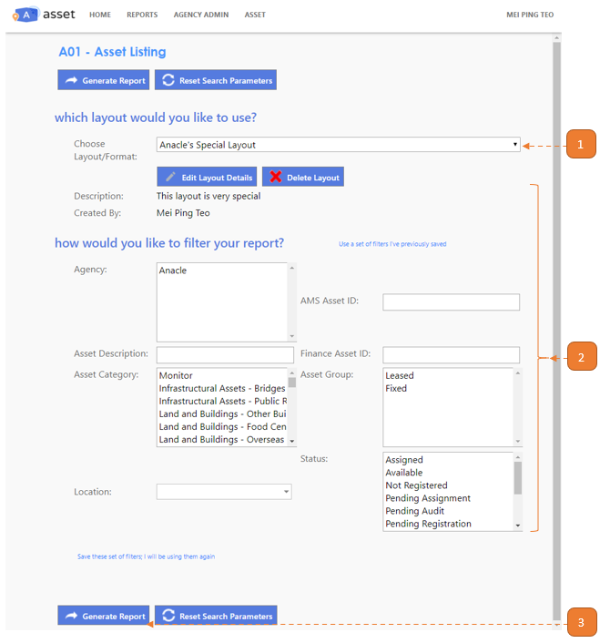
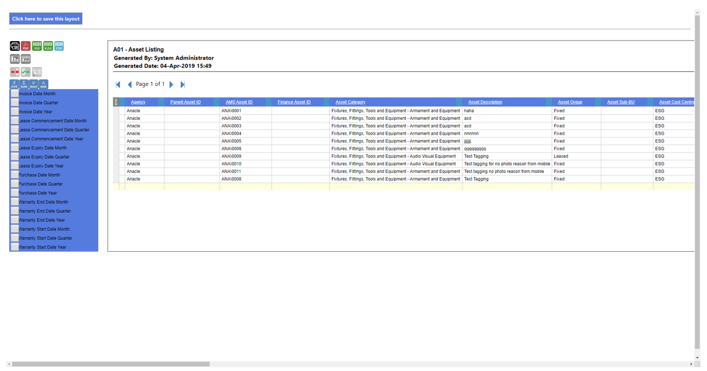

# Generating a report

## How do I generate a report?

> Navigate to **reports and select the report you wish to view**.

1. Select the **Choose Layout/Format**, if any.

- Refer to [Save Layouts](SaveLayouts.md) for details on how to save a report layout.

2. Select the relevant filters.

3. Select **Generate Report**.

The report will appear in a new window such as the image below:

