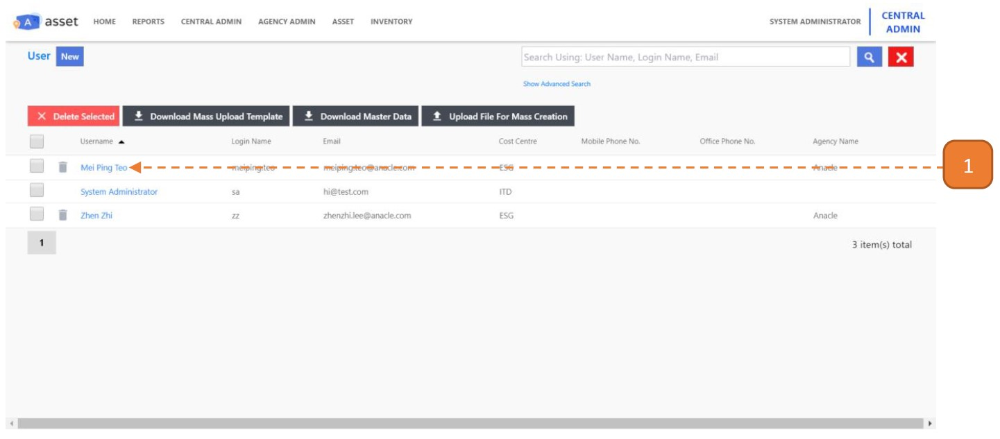
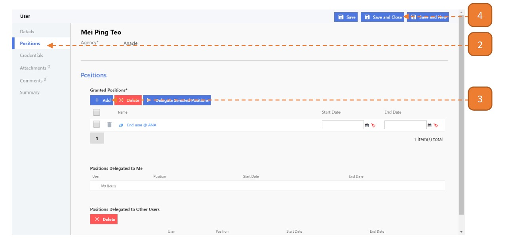

# Grant position to User

## How do I grant a position to a User?

> Navigate to: **Agency Admin > User Administration > User**

1. Select the relevant user record.

2. Select the **Positions** tab.

3. Click **Add**. You may select more than one position with the checkbox.

4. Select **Save and Close**.

