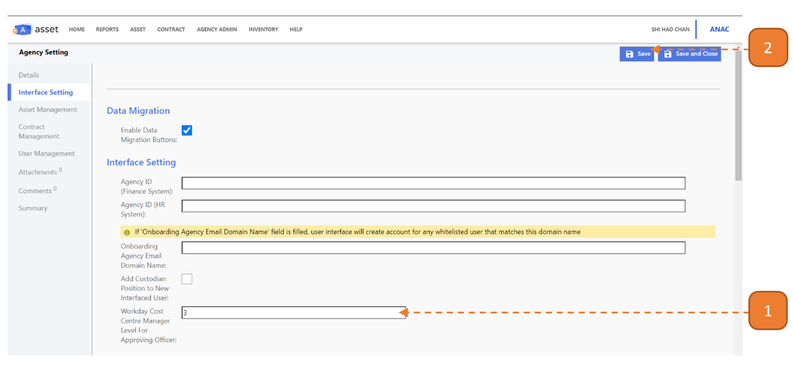

# Indicate Workday CCM Level for AOs

This function allows agencies who interface their user data from Workday to indicate users under the Cost Centre Manager (CCM) level to be automatically assigned the "Approving Officer" position.

## How do I indicate Workday Cost Centre Manager Level for Approving Officers? (Workday Only)

> Navigate to: **Agency Admin > System Administration > Agency Setting**

1. Under **Workday Cost Centre Manager Level For Approving Officer**, enter the level from Workday.

2. Select **Save**.

