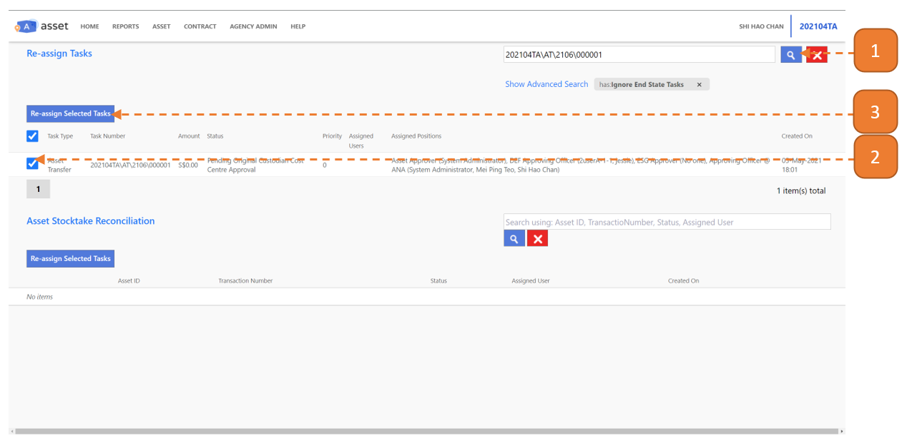
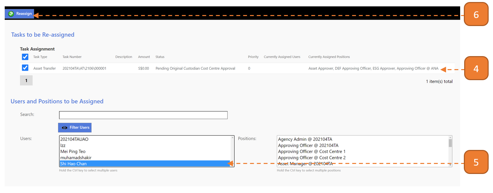
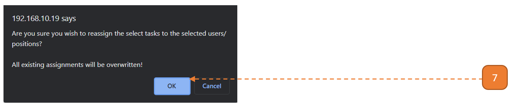

# Non-Stocktake Reconciliation Types

## How do I Reassign Tasks (Non-Stocktake Reconciliation Types)?

Note: Reassign tasks should only be executed at the **last resort** when the transaction is **truly stuck**, ie: Transaction is assigned to user who left the organization.

For cases which the transaction is assigned to a position (with no one), we highly recommend to [perform position assignment to user](GrantpositiontoUser.md) than to perform task reassignment.

> Navigate to: **AGENCY ADMIN > Workflow Administration > Re-assign Tasks**

1. Under **Re-assign Tasks** header search box, search for the relevant transaction.

2. Under the **Re-assign Tasks** table, select the record’s checkbox.

3. Select **Re-assign Selected Tasks**.

 
- A new browser tab will open. Be sure to disable pop up blocker, if applicable.

4. Under the **Task Assignment** table, note the “Currently Assigned Users” and “ Currently Assigned Positions”. 
- Ensure that it’s no longer plausible for the transaction to proceed with these assigned user(s)/position(s).

5. Under **Users and Positions to be Assigned**, select the **Users** and/or **Positions**, where applicable.

6. Select the **Reassign** button.

7. A browser confirmation dialog will appear, select **OK**.

