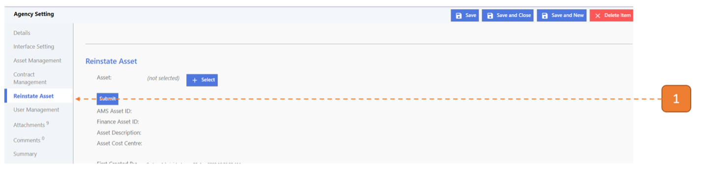

# Asset Reinstatement

## How do I Reinstate an Asset?

**Note:** Record's reinstatement information will **not** be interfaced to Finance System.

> Navigate to: **Agency Admin > System Administration > Agency Setting**.

1. Select **Reinstate Asset** on the left panel under Agency Settings.

2. Click on the **Select** button.

3. A search dialog appears with list of assets that are available for selection. 
Click on the **Select** button of the Asset that you wish to reinstate.

4. Click on **Submit**.

