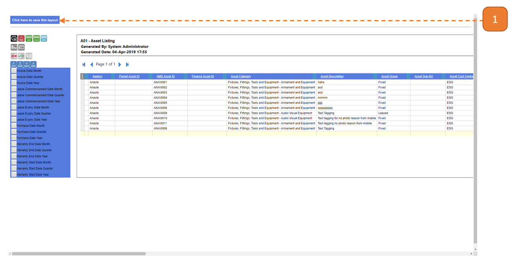
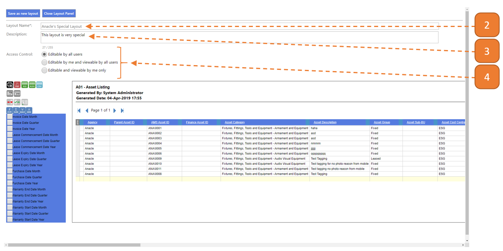
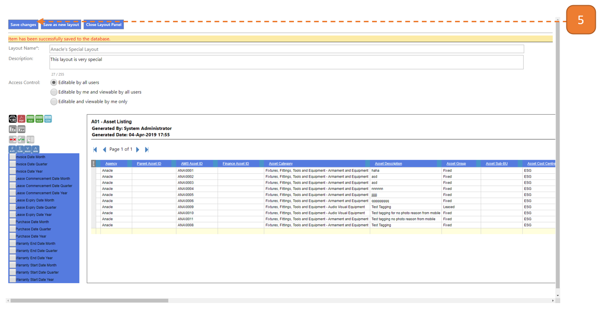

# Save Layouts

## How do I save a Layout?

1. Select **Click here to save this layout**.

2. Enter the **Layout Name**.

3. Enter the **Description**.

4. Select the **Access Control**.

5. Select **Save Changes**.

