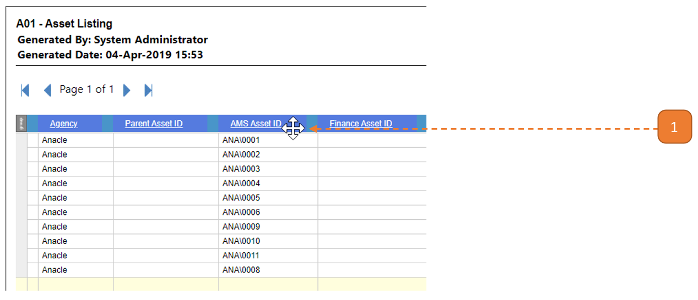
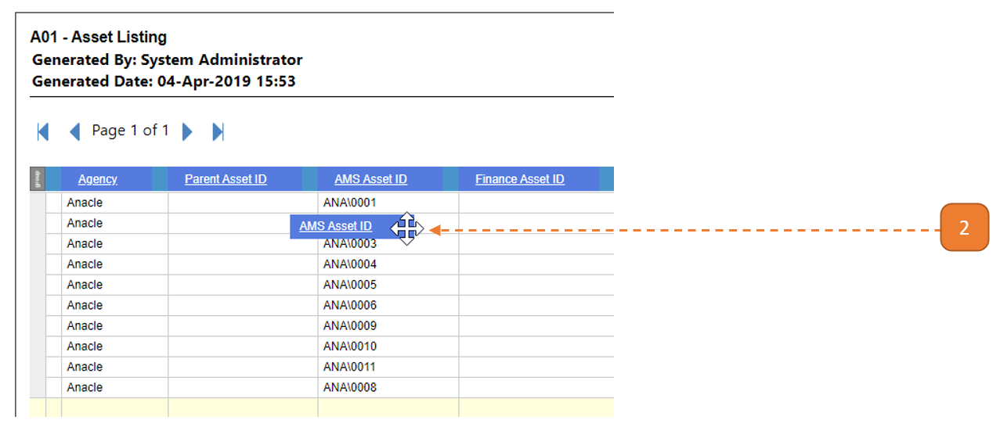
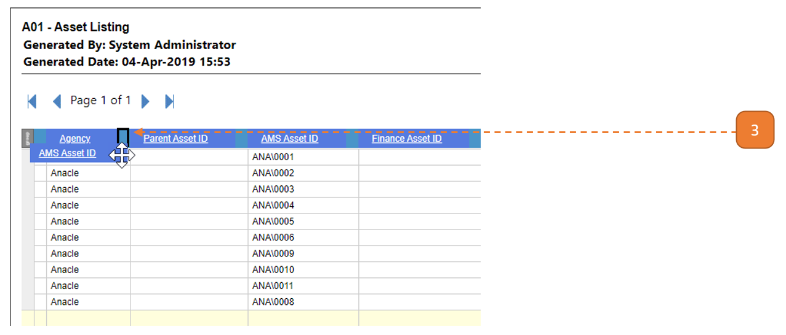
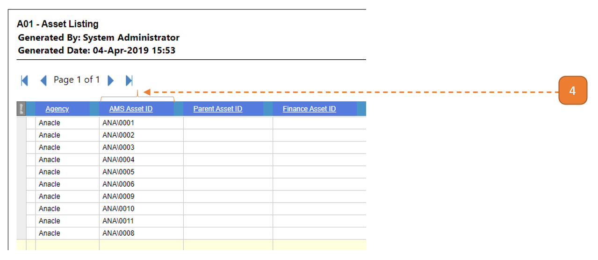

# Sorting Columns

## How do I sort columns?

1. Hover around the **column header** until the **4 Arrow-Cursor** is observed.

2. **Click and drag** the column header. The column header should float with the cursor.

3. While holding on to the mouse click, hover over to the blank spaces between the 2 columns. **When a bolded outline is seen, release the mouse click.**

4. The column will fill between these 2 columns.

