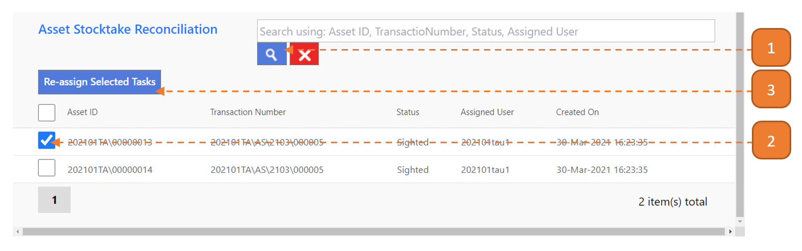
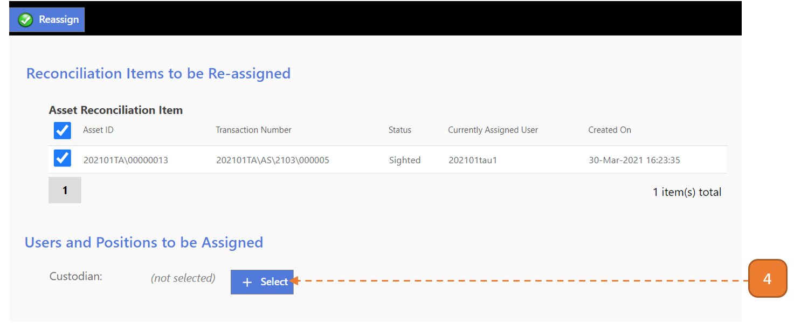
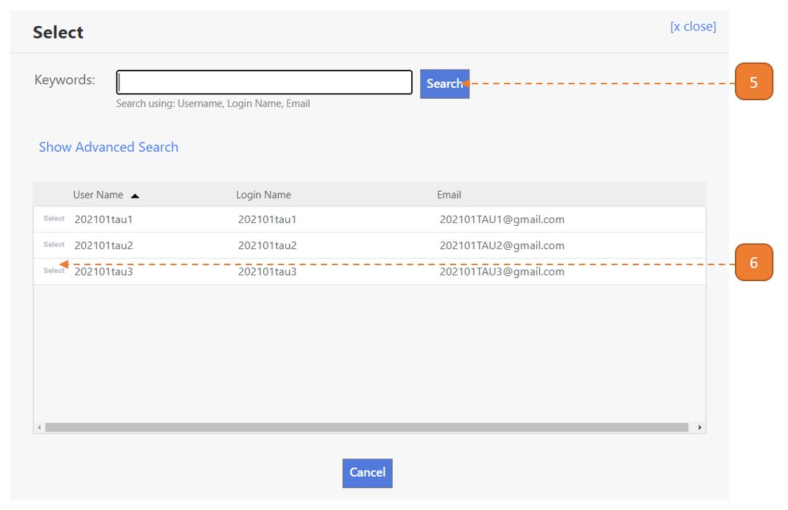
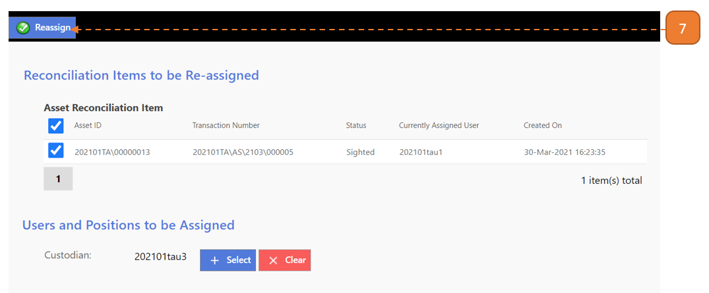
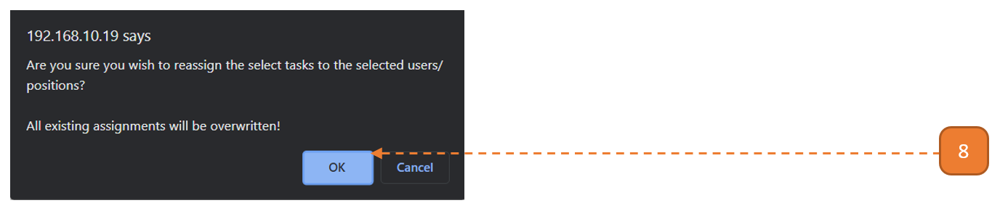

# Stocktake Reconciliation Types

## How do I Reassign Tasks (Stocktake Reconciliation Types)?

Note: Reassign tasks should only be executed at the **last resort** when the transaction is **truly stuck**, ie: Transaction is assigned to custodian who left the organization. 

> Navigate to: **AGENCY ADMIN > Workflow Administration > Re-assign Tasks**

1. Under **Asset Stocktake Reconciliation** header search box, search for the relevant transaction.

2. Under the **Asset Stocktake Reconciliation table**, select the record’s checkbox.

3. Select **Re-assign Selected Tasks**.

4. Select the **Select** button.

5. Search for the reconciliation user.

6. Select the **Select** button.

7. Select the **Reassign** button.

8. A browser confirmation dialog will appear, select **OK**.

