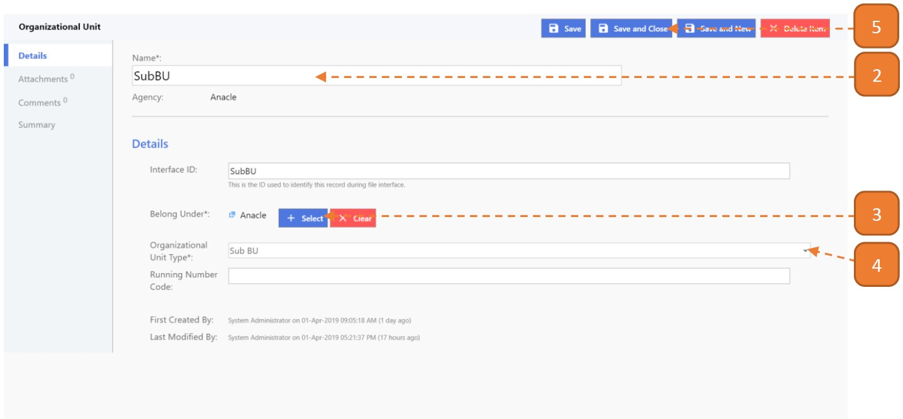

# Sub-Business Unit

## How do I create a Sub-Business Unit?

> Navigate to: **Agency Admin > General Administration > Organizational Unit**

1. Select **New**.

2. Enter **Name** and the **Interface ID** will be automatically populated.

3. Select the **Agency** where this Sub-Business Unit should belong to.

4. Select the **Organizational Unit Type** as **"Sub BU"**.

5. Select **Save and Close**.

