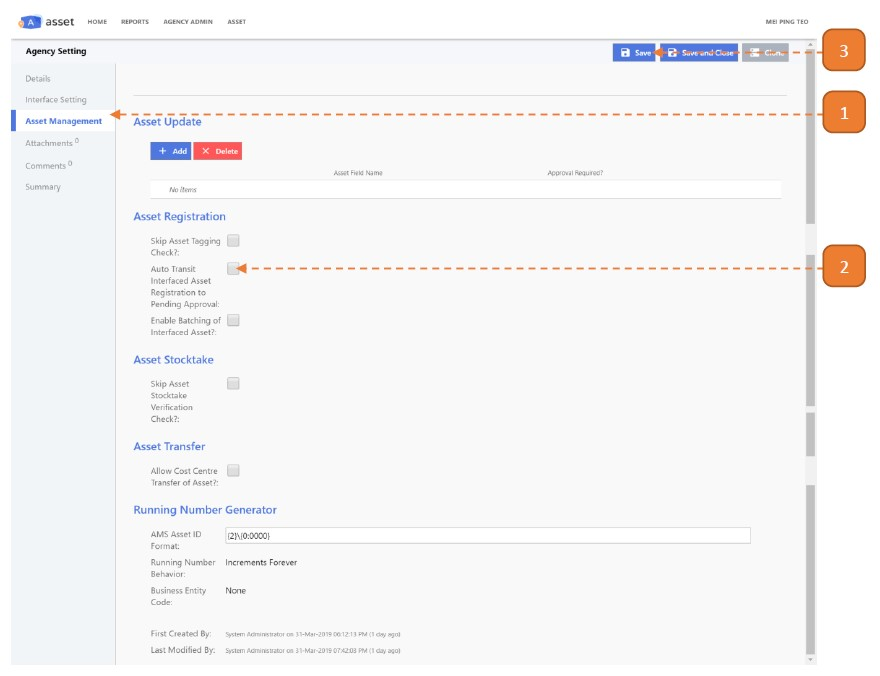

# Transit Interfaced Asset to Tagging stage

## How do I automatically transit Interfaced Asset to Tagging stage?

> Navigate to: **Agency Admin > System Administration > Agency Setting**

1. Select the **Asset Management** tab.

2. Check the option **"Auto Transit Interfaced Asset Registration to Pending Approval"**.

3. Select **Save**.

