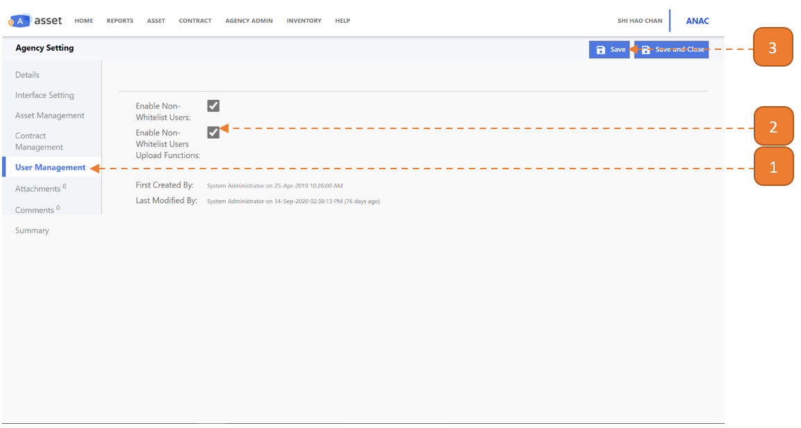

# Upload Functions

## How do I enable Non-Whitelist Users Upload Functions?

Enabling this option allows you access to upload template button in their respective pages: **Asset Transfer, Stocktake Verification** and **Asset Maintenance**.

> Navigate to: **Agency Admin > System Administration > Agency Setting**

1. Select the **User Management** tab.

2. Check the **“Enable Non-Whitelist Users Upload Functions”** option.

3. Select **Save**.

