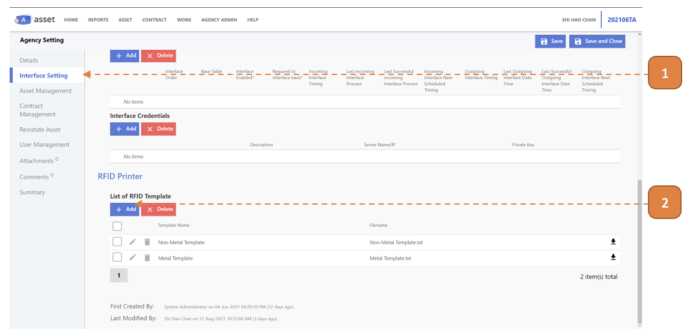
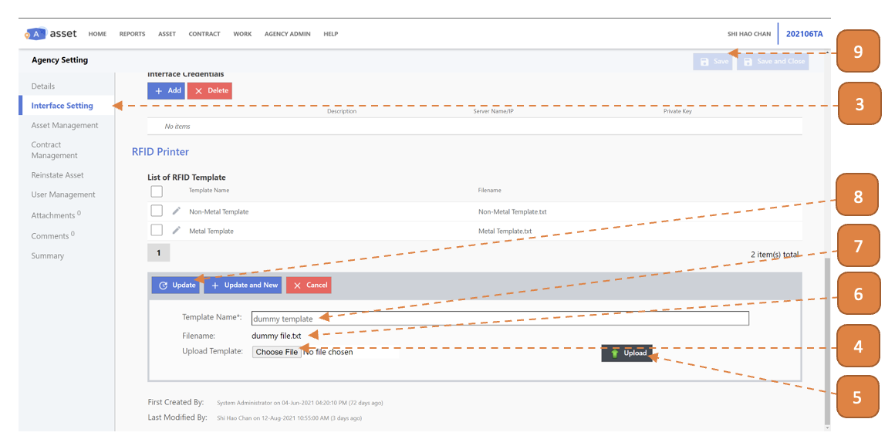

# Upload Printing Template

## How Do I Upload Printing Template?

> Navigate to: **AGENCY ADMIN > System Administration > Agency Setting**

1. Select **Interface Setting**.

2. Select the **Add** button.

3. Select **Interface Setting**.

4. Select **“Choose File”**, browse for the printing template.

5. Select **Upload**.

6. Ensure that the file name shows here.

7. Enter the **Template Name**.

8. Select **Update**.

9. Select **Save**.

